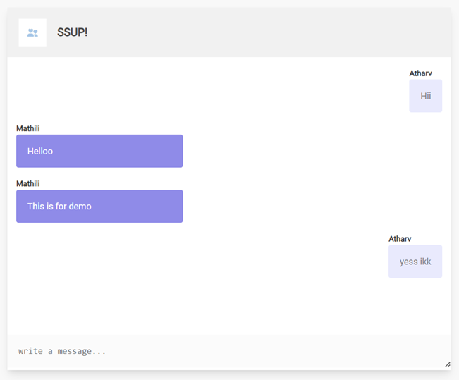

# Realtime Chat App

The Realtime Chat App is a simple chat application that allows users to join a chat room, send messages, and receive real-time updates. It is built using Express.js, Node.js, and Socket.IO.

## User Interface

## Overview

This application provides a real-time communication platform where users can enter their name, type messages, and instantly see messages from other users in the chat room. The chat messages are updated in real-time using the Socket.IO library, providing a seamless and interactive chat experience.

## Features

- **Real-time Messaging**: Messages are sent and received in real-time using Socket.IO.
- **User Identification**: Users are prompted to enter their name before joining the chat.
- **Auto-scroll**: The chat area auto-scrolls to the latest message, ensuring users always see the most recent conversation.
- **Responsive Design**: The application is designed to be responsive across different devices.

## Technologies Used

- **Express.js**: Handles server-side routing and logic.
- **Node.js**: Powers the backend of the application.
- **Socket.IO**: Enables real-time, bidirectional, and event-based communication between clients and the server.
- **HTML/CSS**: Provides the basic structure and styling of the web pages.
- **JavaScript (Client-Side)**: Manages client-side interactions and Socket.IO events.

## File Structure

- **HTML**: Contains `index.html` for the front-end structure.
- **CSS**: Styles are defined in `style.css`.
- **JavaScript (Client-Side)**: The client-side logic is in `script.js`.
- **JavaScript (Server-Side)**: The server-side logic is in `server.js`.
- **Images**: Contains the brand logo.

## Usage

1. Ensure Node.js is installed on your machine.
2. Install the necessary Node.js packages using `npm install`.
3. Start the server using `node server.js` or `npm run dev`.
4. Access the application through a web browser at `http://localhost:3000`.

## How to Use

1. Enter your name when prompted to join the chat.
2. Type your messages in the text area at the bottom of the chat.
3. Press `Enter` to send your message.
4. All users in the chat room will instantly see your message.
5. The chat area auto-scrolls to the latest message.

## Acknowledgments

This project uses the Socket.IO library for real-time communication.
Feel free to join, chat, and experience real-time communication!